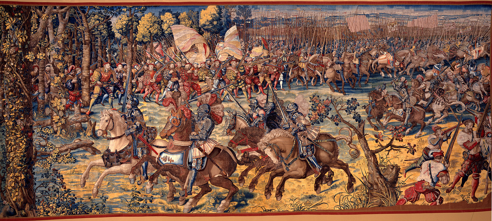

# The Ledall Roll - Enhanced Study Guide

<sub>v0.6.0</sub>

<sup>By Dr. Joel Casimir, D.D.S.</sup>

[](https://creativecommons.org/licenses/by-sa/4.0/)

> *A comprehensive, research-backed training manual for the complete English longsword system preserved in British Library Additional MS 39564 (c. 1535-1550)*


Bernard Van Orley: *The Battle of Pavia (c. 1525–1530)*<sup>[1](#footnotes)</sup>

---

## What Is This?

This repository contains a **complete enhanced study guide** for the Ledall Roll, one of only three surviving Medieval English longsword manuscripts. Unlike typical GitHub repositories, this is a **writing project** - scholarly documentation of a 500-year-old martial arts system.

### The Ledall Roll Manuscript

The Ledall Roll (British Library Additional MS 39564) is a vellum scroll from Tudor England containing **41 plays** (techniques) representing a sophisticated fighting system emphasizing:

- Displacement over binding
- One-handed spring techniques  
- Proffer (feint) strategies
- Multi-opponent tactics
- Conservative safety principles

This manuscript bridges Medieval English martial arts and Renaissance codification by George Silver.

---

## What's Inside

### The Complete Study Guide (`ledall_roll_final_draft.md`)

**7,600+ lines** of comprehensive training content covering all 41 plays:

#### Part I: Flourishes (Chapters 1-3)
Solo training forms and ceremonial techniques - the foundation of practice.

#### Part II: The Chases (Chapters 4-16)  
13 training sequences teaching combinations, footwork, and partner drills - including the unique "Getting Chase" for fighting multiple opponents.

#### Part III: The Counters (Chapters 17-39)
23 defensive responses and tactical applications - the heart of the combat system.

#### Part IV: Special Techniques (Chapters 40-41)
Advanced reactive applications including counter-to-counter tactics.

#### Additional Content
- **Conclusion:** The system as a complete fighting art
- **3 Appendices:** Terminology, training schedules, troubleshooting
- **Complete Bibliography:** 10 academic sources plus additional resources

### Every Chapter Includes

- ✅ Original Middle English text (historical authenticity)
- ✅ Modern English translation
- ✅ Research-backed practitioner tips (with citations)
- ✅ Detailed step-by-step breakdown tables
- ✅ Week-by-week training progressions
- ✅ Tactical applications and combat theory
- ✅ Common mistakes and corrections
- ✅ Historical/cultural context
- ✅ Academic citations and sources
- ✅ Partner drill variations
- ✅ Comparative analysis (English vs. German/Italian systems)

---

## Who Is This For?

### HEMA Practitioners
Complete curriculum for learning Medieval English longsword from beginner to advanced.

### Martial Arts Instructors
Structured lesson plans, step tables, training progressions, and teaching notes.

### Historical Researchers
Fully cited scholarly work with multiple interpretations, comparative analysis, and primary source references.

### Curious Learners
Accessible introduction to a fascinating historical fighting system with clear explanations.

---

## How to Use This Guide

### Quick Start

1. **Read the Introduction** - Understanding the manuscript and English system philosophy
2. **Start with Flourishes** (Chapters 1-3) - Solo warm-up forms
3. **Progress through Chases** (Chapters 4-16) - Training sequences
4. **Study the Counters** (Chapters 17-39) - Tactical applications
5. **Master Special Techniques** (Chapters 40-41) - Advanced applications

### Training Pathways

**Beginners (Months 1-3):**
- Master the three Flourishes
- Learn First Chase thoroughly  
- Practice springs and rabetts in isolation
- Build conditioning and muscle memory

**Intermediate (Months 4-9):**
- Progress through all Chases
- Begin simple Counters
- Develop proffer tactics
- Start light sparring

**Advanced (Months 10+):**
- Master complex Counters
- Practice Special Techniques
- Research and experiment
- Teach others

See **Appendix B** for a complete 12-week beginner program.

---

## Project Structure

```
ledall-study-guide/
│
├── ledall_roll_final_draft.md       # ← THE COMPLETE STUDY GUIDE (START HERE)
│
├── drafts/                          # Outdated development drafts
│   ├── ledall_guide_draft_01.md     # Earlier simple version
│   └── ledall_guide_draft_02.md     # Enhanced version with research
│
├── sections/                        # Session-by-session work
│   ├── ledall_roll_session1_chases.md
│   ├── ledall_roll_session2_counters_1-9.md
│   ├── ledall_roll_session3_counters_11-21.md
│   ├── ledall_roll_session4_final.md
│   └── ledall_roll_session4_special_techniques.md
│
├── manuscript/                      # Source material
│   └── ledall_modernization.csv     # Original manuscript transcript and modernization
│
├── sources.md                       # Complete bibliography
├── overview.md                      # Project completion summary
├── LICENSE.md                       # CC BY-SA 4.0 license
└── README.md                        # This file
```

**Note:** The final draft (`ledall_roll_final_draft.md`) contains all content from the drafts and sessions combined into one cohesive document. The other files are preserved for reference and to show the development process.

---

## Key Features

### Research-Backed
Every technique includes citations from:
- Mark Ryan Geldof's 2023 peer-reviewed manuscript analysis
- Brandon Heslop & Benjamin Bradak's comprehensive interpretation  
- Robert Kay's comparative systems work
- Historical sources including George Silver
- Modern practitioner research and testing

### Practical Focus
- Step-by-step breakdown tables for every technique
- Week-by-week training progressions
- Partner drill variations
- Common mistakes identified and corrected
- Solo practice alternatives where applicable

### Scholarly Rigor
- Proper academic citations throughout
- Multiple interpretations acknowledged
- Uncertainties clearly stated
- Comparative analysis with German and Italian systems
- Historical and cultural context

### Complete Coverage
This is the **only publicly available guide** that documents **all 41 plays** from the Ledall Roll with this level of detail and research integration.

---

## What Makes This Unique?

Unlike simple transcriptions or basic interpretations, this guide provides:

1. **Complete Coverage** - All 41 plays, not just selected techniques
2. **Multiple Perspectives** - Various interpretations where source is ambiguous
3. **Training Methodology** - Progressive week-by-week skill development
4. **Tactical Depth** - When, why, and how to use each technique
5. **Error Prevention** - Common mistakes identified proactively
6. **Historical Context** - Connections to broader English martial tradition
7. **Comparative Analysis** - How English system differs from continental approaches
8. **Pedagogical Structure** - Designed for actual learning and teaching

---

## The English Longsword System

### How It Differs from German/Italian Systems

**German Longsword (Liechtenauer tradition):**
- Emphasis on *Fühlen* (feeling in the bind)
- Extended blade contact through *Winden* (winding)
- Multiple master-cuts (*Meisterhau*)

**Italian Longsword (Fiore, Vadi):**
- Guard-based system (*Poste*)
- Crossing and controlling techniques
- Emphasis on armored combat

**English Longsword (Ledall Roll):**
- **Displacement over binding** - quick cuts to remove threats
- **Springs** - one-handed extensions for maximum reach
- **Proffers** - baited openings and psychological warfare
- **Quarter-and-void** - attacking while retreating for safety
- **Practical focus** - survival over sport, including multi-opponent tactics

### Core Principles

- Distance management through voids and springs
- Initiative maintenance via continuous pressure
- Safety prioritization (conservative tactics)
- Psychological warfare (proffers, feints, deceptions)
- Simplicity and reliability over complexity

---

## How to Contribute

This guide represents current best interpretations based on available scholarship. As research evolves and practitioners experiment, new insights emerge.

### Ways to Contribute

1. **Test the Techniques** - Document what works in practice
2. **Suggest Clarifications** - Identify unclear explanations
3. **Provide Additional Research** - Share relevant academic sources
4. **Report Errors** - Note typos, citation errors, or technical mistakes
5. **Share Interpretations** - Offer alternative reconstructions with reasoning
6. **Translate** - Help make this available in other languages
7. **Add Visual Aids** - Diagrams, photographs, or videos (if copyright-clear)

**To contribute:** Open an issue or submit a pull request. All contributions must maintain scholarly standards and include proper citations.

---

## Recommended Companion Resources

### Primary Sources (Free Online)
- **Wiktenauer** - Complete transcription: <https://wiktenauer.com/wiki/Ledall_Roll_(Additional_MS_39564)>
- **British Library** - Digital manuscript viewer (may require reader ticket)

### Books
- Heslop, B. & Bradak, B. (2010). *Lessons on the English Longsword*. Paladin Press.
- Reich, S. (2019). *English Longsword: A Tactical Approach*. Freelance Academy Press.
- Silver, G. *Paradoxes of Defence* (1599) - Multiple modern reprints available

### Organizations Teaching English Longsword
- **Guild of Knightly Arts** (Missouri, USA)
- **Stoccata School of Defence** (Australia)
- **Academy of Historical Arts** (United Kingdom)
- **Terry Brown's School of English Martial Arts** (Online)

See the Complete Bibliography section in the guide for full references.

---

## Acknowledgments

This study guide was built upon centuries of martial tradition and decades of modern research:

### Original Manuscript
- Medieval English practitioners who created the system
- John Ledall of York (c. 1515-1582) - manuscript commissioner
- Unknown scribe(s) who recorded it

### Modern Preservation
- **Stevie Thurston** - Transcription and modernization
- **Brandon Heslop & Benjamin Bradak** - Interpretation and pedagogy
- **Mark Ryan Geldof** - Academic research and manuscript analysis
- **Robert Kay** - Comparative systems work
- **Terry Brown** - English martial arts research
- **HEMA Community** - Practical testing and knowledge sharing

---

## Technical Notes

### Format
- **Markdown** (.md files) for universal accessibility
- Easily converted to PDF, DOCX, HTML, or ePub
- Version control friendly
- Printable for training use
- Readable on all platforms

### Why Markdown?
- Open format (not proprietary)
- Easy to edit and update
- Perfect for collaborative improvement
- Simple to generate multiple output formats
- Accessible to everyone

### File Encoding
All files use UTF-8 encoding to properly display Middle English special characters (ſ, etc.).

---

## Citation

If you use this guide in your research, teaching, or practice, please cite it as:

```
The Ledall Roll - Enhanced Study Guide. (2025).
Based on British Library Additional MS 39564 (c. 1535-1550).
Original Transcription: Stevie Thurston.
Research Enhancement compiled December 2025.
Retrieved from https://www.github.com/study-flamingo/ledall-study-guide.git
License: CC BY-SA 4.0
```

---

## Disclaimer

This guide represents **current best interpretations** of the historical source material. Medieval manuscripts are inherently ambiguous, and multiple valid reconstructions exist.

- Techniques are presented for **historical study and safe practice**
- **Always train under qualified supervision**
- Use appropriate safety equipment
- Respect your training partners
- This is **not** a substitute for qualified instruction

The authors, contributors, and distributors assume no liability for injuries or misuse.

---

## Status

**Version:** 1.0 Final Draft - Complete Study Guide  
**Status:** Ready for proofreading and editing  
**Coverage:** All 41 plays documented  
**Last Updated:** December 13, 2025

---

## Get Started

1. **Download** `ledall_roll_final_draft.md`
2. **Read the Introduction** to understand the manuscript and system
3. **Start with Chapter 1** - The First Flourish
4. **Progress systematically** through the chapters
5. **Practice safely** with qualified partners
6. **Share your findings** with the community

---

## Questions?

- **HEMA Training:** Contact your local HEMA club or the organizations listed in the guide
- **Historical Questions:** Consult the cited academic sources
- **Technical Issues:** Open an issue in this repository
- **General Discussion:** Engage with the broader HEMA community online

---

## License

This work is licensed under **Creative Commons Attribution-ShareAlike 4.0 International (CC BY-SA 4.0)**.

See [LICENSE.md](LICENSE.md) for full details.

**You are free to:** Share, adapt, and use commercially  
**You must:** Provide attribution and share derivatives under the same license

---

*"The sword is the soul of the warrior. Study it diligently, practice it faithfully, and honor those who preserved it for us."*

**Preserve the tradition. Practice the art. Pass it forward.**

🗡️ **The Medieval English longsword tradition lives on.**

## Footnotes

1. *Willem and Jan Dermoyen, after Bernard van Orley, The Battle of Pavia, c. 1528–31, tapestry (wool, silk, gold, and silver thread), Museo e Real Bosco di Capodimonte, Naples, photograph, Wikimedia Commons, <https://en.wikipedia.org/wiki/Battle_of_Pavia#/media/File:Manif._di_bruxelles_su_dis.di_bernart_von_orley,_IGMN144483,_1526-31.JPG>.*

---

> ### About Bernard van Orley (c. 1487–1541)
>
> Van Orley was the leading Brussels court artist of his time, serving the Habsburg rulers Wikipedia, including Margaret of Austria (from 1515) and being appointed court painter in 1518 Encyclopedia Britannica. Though he never visited Italy, he was heavily influenced by Italian Renaissance painting, especially Raphael's tapestry cartoons Wikipedia that were in Brussels 1516-1520. Albrecht Dürer made a portrait of him in 1521 Encyclopedia Britannica, and the two likely discussed tapestry design while Dürer was van Orley's houseguest.
>
> About the Tapestries:
>
> This is one of seven enormous panels, each about 27 by 14 feet Fine Arts Museums of San Francisco, making them truly monumental works. They were woven in Brussels by Willem and Jan Dermoyen in deeply saturated hues and exquisite detail, luxuriously highlighted with gold and silver thread Kimbell Art Museum. A single panel could take over a year to produce Fine Arts Museums of San Francisco.
>
> The tapestries were commissioned by the States General of the Low Countries as a gift to Emperor Charles V Narratives, presented to him in 1531—six years after the battle. They served as both propaganda celebrating Habsburg victory and as practical insulation for cold stone palaces. The preparatory cartoons (small-scale drawings) survive in the Louvre, Paris.
>
> Why They Matter for HEMA:
>
> These tapestries are remarkably detailed visual records of early 16th-century combat, showing life-size figures Wikipedia in full battle regalia. They depict the transition period when firearms (arquebuses) were beginning to dominate medieval-style armored cavalry—the French heavy cavalry, in full plate armor, were decisively defeated by more nimble imperial troops with firearms. The tapestries show specific arms, armor styles, and tactical formations contemporary to your longsword studies!
